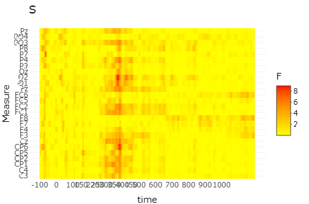

Brain Wave Analysis
================
SYsherley
2023-08-17

## R Markdown

This is an R Markdown document. Markdown is a simple formatting syntax
for authoring HTML, PDF, and MS Word documents. For more details on
using R Markdown see <http://rmarkdown.rstudio.com>.

### Analysis procedure:

1.  Import libraries
2.  Load dataset
3.  Permutation test
4.  Line graph
5.  Linear Mixed Effects Model

``` r
library(tidyverse)
```

    ## ── Attaching core tidyverse packages ──────────────────────── tidyverse 2.0.0 ──
    ## ✔ dplyr     1.1.1     ✔ readr     2.1.4
    ## ✔ forcats   1.0.0     ✔ stringr   1.5.0
    ## ✔ ggplot2   3.4.2     ✔ tibble    3.2.1
    ## ✔ lubridate 1.9.2     ✔ tidyr     1.3.0
    ## ✔ purrr     1.0.1     
    ## ── Conflicts ────────────────────────────────────────── tidyverse_conflicts() ──
    ## ✖ dplyr::filter() masks stats::filter()
    ## ✖ dplyr::lag()    masks stats::lag()
    ## ℹ Use the conflicted package (<http://conflicted.r-lib.org/>) to force all conflicts to become errors

``` r
library(languageR)
library(readxl)
library(ez)
library(lme4)
```

    ## Loading required package: Matrix
    ## 
    ## Attaching package: 'Matrix'
    ## 
    ## The following objects are masked from 'package:tidyr':
    ## 
    ##     expand, pack, unpack

``` r
library(QuantPsyc)
```

    ## Loading required package: boot
    ## Loading required package: MASS
    ## 
    ## Attaching package: 'MASS'
    ## 
    ## The following object is masked from 'package:dplyr':
    ## 
    ##     select
    ## 
    ## 
    ## Attaching package: 'QuantPsyc'
    ## 
    ## The following object is masked from 'package:Matrix':
    ## 
    ##     norm
    ## 
    ## The following object is masked from 'package:base':
    ## 
    ##     norm

``` r
library(Hmisc)
```

    ## 
    ## Attaching package: 'Hmisc'
    ## 
    ## The following objects are masked from 'package:dplyr':
    ## 
    ##     src, summarize
    ## 
    ## The following objects are masked from 'package:base':
    ## 
    ##     format.pval, units

``` r
library(ggplot2)
library(ggpubr)
library(permutes)
library(lmPerm)
library(scales)
```

    ## 
    ## Attaching package: 'scales'
    ## 
    ## The following object is masked from 'package:purrr':
    ## 
    ##     discard
    ## 
    ## The following object is masked from 'package:readr':
    ## 
    ##     col_factor

``` r
library(plotly)
```

    ## 
    ## Attaching package: 'plotly'
    ## 
    ## The following object is masked from 'package:Hmisc':
    ## 
    ##     subplot
    ## 
    ## The following object is masked from 'package:MASS':
    ## 
    ##     select
    ## 
    ## The following object is masked from 'package:ggplot2':
    ## 
    ##     last_plot
    ## 
    ## The following object is masked from 'package:stats':
    ## 
    ##     filter
    ## 
    ## The following object is masked from 'package:graphics':
    ## 
    ##     layout

``` r
library(doParallel)
```

    ## Loading required package: foreach
    ## 
    ## Attaching package: 'foreach'
    ## 
    ## The following objects are masked from 'package:purrr':
    ## 
    ##     accumulate, when
    ## 
    ## Loading required package: iterators
    ## Loading required package: parallel

``` r
library(lpSolve)
library(irr)
library(report)
library(sjPlot)
library(sjmisc)
```

    ## 
    ## Attaching package: 'sjmisc'
    ## 
    ## The following object is masked from 'package:Hmisc':
    ## 
    ##     %nin%
    ## 
    ## The following object is masked from 'package:purrr':
    ## 
    ##     is_empty
    ## 
    ## The following object is masked from 'package:tidyr':
    ## 
    ##     replace_na
    ## 
    ## The following object is masked from 'package:tibble':
    ## 
    ##     add_case

``` r
library(sjlabelled)
```

    ## 
    ## Attaching package: 'sjlabelled'
    ## 
    ## The following object is masked from 'package:forcats':
    ## 
    ##     as_factor
    ## 
    ## The following object is masked from 'package:dplyr':
    ## 
    ##     as_label
    ## 
    ## The following object is masked from 'package:ggplot2':
    ## 
    ##     as_label

``` r
library(data.table)
```

    ## 
    ## Attaching package: 'data.table'
    ## 
    ## The following objects are masked from 'package:lubridate':
    ## 
    ##     hour, isoweek, mday, minute, month, quarter, second, wday, week,
    ##     yday, year
    ## 
    ## The following objects are masked from 'package:dplyr':
    ## 
    ##     between, first, last
    ## 
    ## The following object is masked from 'package:purrr':
    ## 
    ##     transpose

``` r
library(devtools) # tab_model
```

    ## Loading required package: usethis
    ## 
    ## Attaching package: 'usethis'
    ## 
    ## The following object is masked from 'package:sjlabelled':
    ## 
    ##     tidy_labels

``` r
library(dplyr)
library(lmerTest)# tab_model
```

    ## 
    ## Attaching package: 'lmerTest'
    ## 
    ## The following object is masked from 'package:lme4':
    ## 
    ##     lmer
    ## 
    ## The following object is masked from 'package:stats':
    ## 
    ##     step

``` r
library(pbkrtest)
library(car)
```

    ## Loading required package: carData
    ## 
    ## Attaching package: 'car'
    ## 
    ## The following object is masked from 'package:boot':
    ## 
    ##     logit
    ## 
    ## The following object is masked from 'package:dplyr':
    ## 
    ##     recode
    ## 
    ## The following object is masked from 'package:purrr':
    ## 
    ##     some

``` r
library(Hmisc)
library(tibble) # reorder
library(normentR) #function "theme_norment"
```

    ## Loading required package: png
    ## -----------------------------------------------------------------
    ## Welcome to the {normentR} package!
    ## Version: 0.1.6
    ## If there's any questions about how to use this package,
    ##   please ask Daniel in B48!
    ## The default ggplot theme has been replaced with theme_norment()
    ## -----------------------------------------------------------------

``` r
library(olsrr)
```

    ## 
    ## Attaching package: 'olsrr'
    ## 
    ## The following object is masked from 'package:MASS':
    ## 
    ##     cement
    ## 
    ## The following object is masked from 'package:datasets':
    ## 
    ##     rivers

### Load dataset

dataset: EEGL2 Note: this dataset has been processed. Here ignored the
data cleaning process because it related to personal information.

``` r
braindata<-read_csv("EEGL2.csv") 
```

    ## Rows: 977200 Columns: 37
    ## ── Column specification ────────────────────────────────────────────────────────
    ## Delimiter: ","
    ## chr  (6): descrip, Subject, Gender, Semantic, Condition, Item
    ## dbl (31): time, Fp1, AF3, F7, F3, FC1, FC5, C3, CP1, CP5, P7, P3, Pz, PO3, O...
    ## 
    ## ℹ Use `spec()` to retrieve the full column specification for this data.
    ## ℹ Specify the column types or set `show_col_types = FALSE` to quiet this message.

``` r
head(braindata, 3) # show 3 rows
```

    ## # A tibble: 3 × 37
    ##    time    Fp1   AF3    F7    F3   FC1   FC5     C3   CP1    CP5    P7      P3
    ##   <dbl>  <dbl> <dbl> <dbl> <dbl> <dbl> <dbl>  <dbl> <dbl>  <dbl> <dbl>   <dbl>
    ## 1  -200 -1.03  -2.93  3.74 -3.31 -5.10 1.56  -0.533 -4.36 -0.376 -1.16 1.30   
    ## 2  -198 -0.714 -2.62  3.50 -3.22 -5.45 1.24  -1.22  -5.22 -1.12  -1.10 0.782  
    ## 3  -196 -0.216 -2.23  2.96 -3.09 -5.65 0.312 -2.14  -5.96 -1.95  -1.02 0.00839
    ## # ℹ 25 more variables: Pz <dbl>, PO3 <dbl>, O1 <dbl>, Oz <dbl>, O2 <dbl>,
    ## #   PO4 <dbl>, P4 <dbl>, P8 <dbl>, CP6 <dbl>, CP2 <dbl>, C4 <dbl>, FC6 <dbl>,
    ## #   FC2 <dbl>, F4 <dbl>, F8 <dbl>, AF4 <dbl>, Fp2 <dbl>, Fz <dbl>, Cz <dbl>,
    ## #   descrip <chr>, Subject <chr>, Gender <chr>, Semantic <chr>,
    ## #   Condition <chr>, Item <chr>

### Permutation test

Running permutation tests to find out the potential sources of G and S
effects. For instance, the distribution of effects among the brain and
the potential time window.

``` r
# select -100 - 1000 ms
braindataPerm<-braindata[braindata$time >=-100 & braindata$time <=1000,]
```

    # permutation. S+ vs S-
    permtest_S<-permu.test(cbind(FC1,FC5,C3,CP1,CP5,P7,P3,Pz,PO3,O1,Oz,O2,PO4,
                                 P4,P8,CP6,CP2,C4,FC6,FC2,Cz,F3,F4,F7,F8,Fz) # 26.without Fp1,Fp2,AF3,AF4,T7,T8
                           ~ S|time, data = braindataPerm) 

    # present time scale on the plot
    unique(permtest_S$time) # -100 is now 1 etc. - rescale using scales package
    permtest_S$time <- as.numeric(as.character(permtest_S$time))
    permtest_S$time <- scales::rescale(x = permtest_S$time, to = c(-100, 1000))

    permutes_interactive_S <- ggplotly(
      permtest_S %>%
        mutate(time = as.numeric(as.character(time)))  %>%
        ggplot(aes(x = time,
                   y = Measure,
                   fill = F)) +
        scale_x_continuous(breaks = c(-100,0,100,150,220,250,300,350,400,450,500,600,700,800,900,1000))+
        geom_tile() +
        scale_fill_gradient(low = "yellow", # exchange colours if you like
                            high = "red") +
        ggtitle("SL2") +
        theme_minimal()
    ) # save final plot as png or similar
    permutes_interactive_S



    permutation. G+ vs G-

## G+ vs G-

permtest_G\<-permu.test(cbind(FC1,FC5,C3,CP1,CP5,P7,P3,Pz,PO3,O1,Oz,
O2,PO4,P4,P8,CP6,CP2,C4,FC6,FC2,Cz,F3,F4,F7,F8,Fz) \# 26 \~
Gender\|time, data = EnDuN18Perm) plot(permtest_G)

permtest_G2\<-permu.test(cbind(FC1,FC5,C3,CP1,CP5,P7,P3,Pz,PO3,O1,Oz,
O2,PO4,P4,P8,CP6,CP2,C4,FC6,FC2,Cz,F3,F4,F7,F8,Fz) \# 26 \~
Gender\|time, data = EnDuN18Perm2) plot(permtest_G2)

unique(permtest_G2$time) # 300 is now 1 etc. - rescale using scales package permtest_G2$time
\<- as.numeric(as.character(permtest_G2$time)) permtest_G2$time \<-
scales::rescale(x = permtest_G2\$time, to = c(-100, 1200))

permutes_interactive_G2 \<- ggplotly( permtest_G2 %\>% mutate(time =
as.numeric(as.character(time))) %\>% ggplot(aes(x = time, y = Measure,
fill = F)) + scale_x\_continuous(breaks =
c(-100,0,100,150,220,250,300,350,400,450,500,600,700,800,900,1000))+
geom_tile() + scale_fill_gradient(low = “yellow”, \# exchange colours if
you like high = “red”) + ggtitle(“G”) + theme_minimal() ) \# save final
plot as png or similar permutes_interactive_G2

# 

# select -100 - 1000 ms

EnDu_N3Perm\<-EnDu_N3\[EnDu_N3$time >=-100 & EnDu_N3$time \<=1200,\]

## semantic permutation. G+ vs G-

permtestN3_G\<-permu.test(cbind(FC1,FC5,C3,CP1,CP5,P7,P3,Pz,PO3,O1,Oz,O2,PO4,
P4,P8,CP6,CP2,C4,FC6,FC2,Cz,F3,F4,F7,F8,Fz) \# 26.without
Fp1,Fp2,AF3,AF4,T7,T8 \~ Gender\|time, data = EnDu_N3Perm)
plot(permtestN3_G)

unique(permtestN3_G$time) # 300 is now 1 etc. - rescale using scales package permtestN3_G$time
\<- as.numeric(as.character(permtestN3_G$time)) permtestN3_G$time \<-
scales::rescale(x = permtestN3_G\$time, to = c(-100, 1200))

permutes_interactive_G \<- ggplotly( permtestN3_G %\>% mutate(time =
as.numeric(as.character(time))) %\>% ggplot(aes(x = time, y = Measure,
fill = F)) + scale_x\_continuous(breaks =
c(-100,0,100,150,220,250,300,350,400,450,500,600,700,800,900,1000))+
geom_tile() + scale_fill_gradient(low = “yellow”, \# exchange colours if
you like high = “red”) + ggtitle(“G EnDuL2N3”) + theme_minimal() ) \#
save final plot as png or similar permutes_interactive_G \`\`\`

## Including Plots

Note that the `echo = FALSE` parameter was added to the code chunk to
prevent printing of the R code that generated the plot.
