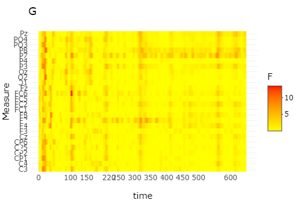

Brain Wave Analysis
================
SYsherley
2023-08-17

### Context

This R Markdown document demonstrates a simplified process for analyzing
a brainwave dataset collected from a group of non-native speakers during
a linguistic experiment involving speech production.

The dataset comprises voltage amplitudes recorded from 32 brain regions,
spanning from -200 ms to 3,000 ms post-stimulus onset for each speaker.

The simplified process presented in this document involves checking the
potential sources of effects in the brain waves, specifying a potential
region-of-interest and time window. Then, moving forward to creating a
grand averaged line graph plot to visualize the difference between
voltage amplitudes elicited by conditions, and finally conducting linear
mixed effects models to assess the statistical significance of each
factor’s impact on amplitudes within the specified region-of-interest
and time window.

### Analysis process:

1.  Import libraries
2.  Load dataset
3.  Permutation test (permu.test())
4.  Line graph (ggplot())
5.  Linear Mixed Effects Model

``` r
library(tidyverse)
```

    ## ── Attaching core tidyverse packages ──────────────────────── tidyverse 2.0.0 ──
    ## ✔ dplyr     1.1.1     ✔ readr     2.1.4
    ## ✔ forcats   1.0.0     ✔ stringr   1.5.0
    ## ✔ ggplot2   3.4.2     ✔ tibble    3.2.1
    ## ✔ lubridate 1.9.2     ✔ tidyr     1.3.0
    ## ✔ purrr     1.0.1     
    ## ── Conflicts ────────────────────────────────────────── tidyverse_conflicts() ──
    ## ✖ dplyr::filter() masks stats::filter()
    ## ✖ dplyr::lag()    masks stats::lag()
    ## ℹ Use the conflicted package (<http://conflicted.r-lib.org/>) to force all conflicts to become errors

``` r
library(languageR)
library(readxl)
library(ez)
library(lme4)
```

    ## Loading required package: Matrix
    ## 
    ## Attaching package: 'Matrix'
    ## 
    ## The following objects are masked from 'package:tidyr':
    ## 
    ##     expand, pack, unpack

``` r
library(QuantPsyc)
```

    ## Loading required package: boot
    ## Loading required package: MASS
    ## 
    ## Attaching package: 'MASS'
    ## 
    ## The following object is masked from 'package:dplyr':
    ## 
    ##     select
    ## 
    ## 
    ## Attaching package: 'QuantPsyc'
    ## 
    ## The following object is masked from 'package:Matrix':
    ## 
    ##     norm
    ## 
    ## The following object is masked from 'package:base':
    ## 
    ##     norm

``` r
library(Hmisc)
```

    ## 
    ## Attaching package: 'Hmisc'
    ## 
    ## The following objects are masked from 'package:dplyr':
    ## 
    ##     src, summarize
    ## 
    ## The following objects are masked from 'package:base':
    ## 
    ##     format.pval, units

``` r
library(ggplot2)
library(ggpubr)
library(permutes)
library(lmPerm)
library(scales)
```

    ## 
    ## Attaching package: 'scales'
    ## 
    ## The following object is masked from 'package:purrr':
    ## 
    ##     discard
    ## 
    ## The following object is masked from 'package:readr':
    ## 
    ##     col_factor

``` r
library(plotly)
```

    ## 
    ## Attaching package: 'plotly'
    ## 
    ## The following object is masked from 'package:Hmisc':
    ## 
    ##     subplot
    ## 
    ## The following object is masked from 'package:MASS':
    ## 
    ##     select
    ## 
    ## The following object is masked from 'package:ggplot2':
    ## 
    ##     last_plot
    ## 
    ## The following object is masked from 'package:stats':
    ## 
    ##     filter
    ## 
    ## The following object is masked from 'package:graphics':
    ## 
    ##     layout

``` r
library(doParallel)
```

    ## Loading required package: foreach
    ## 
    ## Attaching package: 'foreach'
    ## 
    ## The following objects are masked from 'package:purrr':
    ## 
    ##     accumulate, when
    ## 
    ## Loading required package: iterators
    ## Loading required package: parallel

``` r
library(lpSolve)
library(irr)
library(report)
library(sjPlot)
library(sjmisc)
```

    ## 
    ## Attaching package: 'sjmisc'
    ## 
    ## The following object is masked from 'package:Hmisc':
    ## 
    ##     %nin%
    ## 
    ## The following object is masked from 'package:purrr':
    ## 
    ##     is_empty
    ## 
    ## The following object is masked from 'package:tidyr':
    ## 
    ##     replace_na
    ## 
    ## The following object is masked from 'package:tibble':
    ## 
    ##     add_case

``` r
library(sjlabelled)
```

    ## 
    ## Attaching package: 'sjlabelled'
    ## 
    ## The following object is masked from 'package:forcats':
    ## 
    ##     as_factor
    ## 
    ## The following object is masked from 'package:dplyr':
    ## 
    ##     as_label
    ## 
    ## The following object is masked from 'package:ggplot2':
    ## 
    ##     as_label

``` r
library(data.table)
```

    ## 
    ## Attaching package: 'data.table'
    ## 
    ## The following objects are masked from 'package:lubridate':
    ## 
    ##     hour, isoweek, mday, minute, month, quarter, second, wday, week,
    ##     yday, year
    ## 
    ## The following objects are masked from 'package:dplyr':
    ## 
    ##     between, first, last
    ## 
    ## The following object is masked from 'package:purrr':
    ## 
    ##     transpose

``` r
library(devtools) # tab_model
```

    ## Loading required package: usethis
    ## 
    ## Attaching package: 'usethis'
    ## 
    ## The following object is masked from 'package:sjlabelled':
    ## 
    ##     tidy_labels

``` r
library(dplyr)
library(lmerTest)# tab_model
```

    ## 
    ## Attaching package: 'lmerTest'
    ## 
    ## The following object is masked from 'package:lme4':
    ## 
    ##     lmer
    ## 
    ## The following object is masked from 'package:stats':
    ## 
    ##     step

``` r
library(pbkrtest)
library(car)
```

    ## Loading required package: carData
    ## 
    ## Attaching package: 'car'
    ## 
    ## The following object is masked from 'package:boot':
    ## 
    ##     logit
    ## 
    ## The following object is masked from 'package:dplyr':
    ## 
    ##     recode
    ## 
    ## The following object is masked from 'package:purrr':
    ## 
    ##     some

``` r
library(Hmisc)
library(tibble) # reorder
library(normentR) #function "theme_norment"
```

    ## Loading required package: png
    ## -----------------------------------------------------------------
    ## Welcome to the {normentR} package!
    ## Version: 0.1.6
    ## If there's any questions about how to use this package,
    ##   please ask Daniel in B48!
    ## The default ggplot theme has been replaced with theme_norment()
    ## -----------------------------------------------------------------

``` r
library(olsrr)
```

    ## 
    ## Attaching package: 'olsrr'
    ## 
    ## The following object is masked from 'package:MASS':
    ## 
    ##     cement
    ## 
    ## The following object is masked from 'package:datasets':
    ## 
    ##     rivers

#### Load dataset

dataset: EEGL2 Note: this dataset has been processed. Here ignored the
data cleaning process because it related to personal information.

``` r
braindata<-read_csv("EEGL2.csv") 
```

    ## Rows: 977200 Columns: 37
    ## ── Column specification ────────────────────────────────────────────────────────
    ## Delimiter: ","
    ## chr  (6): descrip, Subject, Gender, Semantic, Condition, Item
    ## dbl (31): time, Fp1, AF3, F7, F3, FC1, FC5, C3, CP1, CP5, P7, P3, Pz, PO3, O...
    ## 
    ## ℹ Use `spec()` to retrieve the full column specification for this data.
    ## ℹ Specify the column types or set `show_col_types = FALSE` to quiet this message.

``` r
head(braindata, 3) # show 3 rows
```

    ## # A tibble: 3 × 37
    ##    time    Fp1   AF3    F7    F3   FC1   FC5     C3   CP1    CP5    P7      P3
    ##   <dbl>  <dbl> <dbl> <dbl> <dbl> <dbl> <dbl>  <dbl> <dbl>  <dbl> <dbl>   <dbl>
    ## 1  -200 -1.03  -2.93  3.74 -3.31 -5.10 1.56  -0.533 -4.36 -0.376 -1.16 1.30   
    ## 2  -198 -0.714 -2.62  3.50 -3.22 -5.45 1.24  -1.22  -5.22 -1.12  -1.10 0.782  
    ## 3  -196 -0.216 -2.23  2.96 -3.09 -5.65 0.312 -2.14  -5.96 -1.95  -1.02 0.00839
    ## # ℹ 25 more variables: Pz <dbl>, PO3 <dbl>, O1 <dbl>, Oz <dbl>, O2 <dbl>,
    ## #   PO4 <dbl>, P4 <dbl>, P8 <dbl>, CP6 <dbl>, CP2 <dbl>, C4 <dbl>, FC6 <dbl>,
    ## #   FC2 <dbl>, F4 <dbl>, F8 <dbl>, AF4 <dbl>, Fp2 <dbl>, Fz <dbl>, Cz <dbl>,
    ## #   descrip <chr>, Subject <chr>, Gender <chr>, Semantic <chr>,
    ## #   Condition <chr>, Item <chr>

#### Permutation test

Running permutation tests to find out the potential sources of G and S
effects. For instance, the distribution of effects among the brain and
the potential time window.

    # select -100 - 1000 ms
    braindataPerm<-braindata[braindata$time >=-100 & braindata$time <=1000,]

    # permutation. S+ vs S-
    permtest_S<-permu.test(cbind(FC1,FC5,C3,CP1,CP5,P7,P3,Pz,PO3,O1,Oz,O2,PO4,
                                 P4,P8,CP6,CP2,C4,FC6,FC2,Cz,F3,F4,F7,F8,Fz) # 26.without Fp1,Fp2,AF3,AF4,T7,T8
                           ~ S|time, data = braindataPerm) 

    # present time scale on the plot
    unique(permtest_S$time) # -100 is now 1 etc. - rescale using scales package
    permtest_S$time <- as.numeric(as.character(permtest_S$time))
    permtest_S$time <- scales::rescale(x = permtest_S$time, to = c(-100, 1000))

    permutes_interactive_S <- ggplotly(
      permtest_S %>%
        mutate(time = as.numeric(as.character(time)))  %>%
        ggplot(aes(x = time,
                   y = Measure,
                   fill = F)) +
        scale_x_continuous(breaks = c(-100,0,100,150,220,250,300,350,400,450,500,600,700,800,900,1000))+
        geom_tile() +
        scale_fill_gradient(low = "yellow", # exchange colours if you like
                            high = "red") +
        ggtitle("SL2") +
        theme_minimal()
    ) # save final plot as png
    permutes_interactive_S


    # permutation. G+ vs G-
    permtest_G<-permu.test(cbind(FC1,FC5,C3,CP1,CP5,P7,P3,Pz,PO3,O1,Oz,
                                 O2,PO4,P4,P8,CP6,CP2,C4,FC6,FC2,Cz,F3,F4,F7,F8,Fz) # 26
                           ~ G|time, data = braindataPerm)
    plot(permtest_G)

    unique(permtest_G$time) # -100 is now 1 etc. - rescale using scales package
    permtest_G$time <- as.numeric(as.character(permtest_G2$time))
    permtest_G$time <- scales::rescale(x = permtest_G2$time, to = c(-100, 1200))

    permutes_interactive_G <- ggplotly(
      permtest_G %>%
        mutate(time = as.numeric(as.character(time)))  %>%
        ggplot(aes(x = time,
                   y = Measure,
                   fill = F)) +
        scale_x_continuous(breaks = c(-100,0,100,150,220,250,300,350,400,450,500,600,700,800,900,1000))+
        geom_tile() +
        scale_fill_gradient(low = "yellow", # exchange colours if you like
                            high = "red") +
        ggtitle("G") +
        theme_minimal()
    ) # save final plot as png 
    permutes_interactive_G 



From the plot, we can see that the potential S effect could be found in
the time window of around 400 ms. Moreover, there appears to be no G
effect. The potential S effect is distributed around centro-parietal
regions. Here we select 10 electrodes C3, C4, Cz \| CP1, CP2, CP5, CP6
\| P3, P4, and Pz to create a line graph.

#### Line graph

    # Preparation
    # reorder column names
    colnames(braindata) # Get column names
    braindata <-braindata [, c("Subject" , "G", "S","Condition", "descrip","Item",
                                   "time", "Fp1","AF3","F7","F3","FC1","FC5","C3","CP1","CP5",
                                   "P7","P3","Pz","PO3","O1","Oz","O2","PO4","P4","P8",
                                   "CP6","CP2","C4","FC6","FC2","F4","F8","AF4","Fp2", "Fz","Cz")]

    # from 'wide' to 'long'
    braindata_long <- gather(braindata, Channel, Amplitude, Fp1:Cz, factor_key=TRUE) # have a long formate

    # remove time>800 
    braindata_long<-braindata_long[braindata_long$time <=800,]

    # from 'long' to 'wide'
    braindata_long2<-spread(braindata, time, Amplitude) 


    braindata_long2$S<-as.factor(as.character(braindata_long2$S))
    braindata_long2$G<-as.factor(as.character(braindata_long2$G))
    braindata_long2$Condition<-as.factor(as.character(braindata_long2$Condition))

    # select 10 electrodes
    # C3, C4, Cz | CP1, CP2, CP5, CP6| P3, P4, Pz
    roiCP_10N4<-c("C3","C4","Cz","CP1","CP2","CP5","CP6","P3","P4","Pz")

    braindata_long_10N4 <- braindata_long2 %>%
      filter(Channel %in% roiCP_10N4)  
    braindata_long_10N4$Channel<-as.factor(as.character(braindata_long_10N4$Channel))
    levels(braindata_long_10N4$Channel) # 10

    # Group roiCP_10N4 channels (10 CP) by informative variables

    # Group by S: 
    braindata_long_10N4S <- braindata_long_10N4 %>%
      group_by(Subject,S) %>%
      summarise_at(vars(names(.)[8:ncol(.)]), list(~ mean(., na.rm = TRUE))) %>%
      ungroup() 

    braindata_long_10N4Semantic$S<-as.factor(character(braindata_long_10N4S$S))
    levels(braindata_long_10N4Semantic$S)

    # S df: braindata_long_10N4S
    braindata_long_10N4S_CP<- braindata_long_10N4S %>% 
      pivot_longer(-c(Subject,S), names_to = "Time", values_to = "Amplitude") %>%
      mutate(Time = as.numeric(Time))
    meanbraindata_long_10N4S_CPPlot<- braindata_long_10N4S_CP %>% group_by(S,Time)%>% 
      dplyr::summarise(
        Mean_Amplitude = mean(Amplitude),
        CIlower = Rmisc::CI(Amplitude, ci = 0.95)["lower"],
        CIupper = Rmisc::CI(Amplitude, ci = 0.95)["upper"])

    # 10 Semantic
    S_10CP_Plot <- ggplot(meanbraindata_long_10N4Semantic_CPPlot, aes(x = Time, y = Mean_Amplitude, 
                                                                  colour = S,
                                                                  group = S)) + 
      #geom_ribbon(aes(ymin = CIlower, ymax = CIupper, fill = S), 
                  #alpha = 0.1, linetype = 0) + 
      scale_y_continuous(trans = "reverse",                 # reverse the y-axis 
                         breaks = seq(-10,10,1),            # customize the scale
                         labels = paste0(seq(-10,10,1))) +
      geom_line(linewidth = 0.7) 
    S_10CP_Plot

    S_10CP_Plot1<-S_10CP_Plot+ 
      scale_color_manual(name = "S", values=c('#00BFC4','#F8766D')) +   
      scale_fill_manual(name = "S", values=c('#00BFC4','#F8766D')) + 
      scale_x_continuous(breaks = c(0,100,240,400,480,600,800)) + 
      #scale_y_continuous(breaks = c(seq(-2,-1,1), seq(1,6,1))) + 
      coord_cartesian() +
      labs(title = "Centro-parietal Regions",
           x = "Time (ms)", 
           y = "Amplitude (?V)") + 
      geom_vline(xintercept = 0,linetype = "dashed" )+ 
      geom_hline(yintercept = 0,linetype = "solid")+
      annotate("rect", xmin = 240, xmax = 480, ymin = 10, ymax = -5,
               alpha = .2)+
      theme_norment(ticks = TRUE, grid = TRUE)+
      theme(
        legend.position = "right")+
      theme(panel.border = element_blank(),
            #strip.background = element_blank(),
            #panel.grid.major = element_blank()#, 
            panel.grid.minor = element_blank()
      )+
      theme(axis.title.x = element_text(size=14,family="serif"), # font
            axis.text.x = element_text(size=14,family="serif"),
            axis.title.y = element_text(size=14,family="serif"),
            axis.text.y = element_text(size=14,family="serif"),
            legend.title = element_text(size=18,family="serif"),
            legend.text = element_text(size=17,family="serif"),
            plot.title=element_text(size=18,family="serif",face = "plain"))
    S_10CP_Plot1+ geom_line(linewidth = 1)

    ggsave("L2_CP(10)S.png", width = 20, height = 12, units = "cm")

<figure>

<figcaption aria-hidden="true">line graph_S</figcaption>
</figure>

This graph shows S voltage amplitudes for centro-parietal channels C3,
C4, Cz, CP1, CP2, CP5, CP6, P3, P4, and Pz. The N400 time window of
interest from 240 ms to 480 ms is highlighted in grey. Note that
negative voltage amplitudes are plotted upwards. Voltage amplitudes for
the Un condition were more negative compared to the Rel condition.

#### LMM

    # preparation: 
    braindata_2<-braindata
    ## working df: braindata_2

    # region: C3, C4, Cz | CP1, CP2, CP5, CP6 | P3, P4, Pz  # 10

    # Centro-posterior_N4
    braindata_2$Amplitude_4CP_L<-rowMeans(braindata_2[,c('C3','CP1','CP5','P3')]) 
    braindata_2$Amplitude_4CP_R<-rowMeans(braindata_2[,c('C4','CP2','CP6','P4')])
    braindata_2$Amplitude_2CP_M<-rowMeans(braindata_2[,c('Cz','Pz')])

    # 4 ROIs
    braindata_4CP_L<-EnDuN18_2[,c('Amplitude_4CP_L','time','Subject','Item','descrip','G','S','Condition')]
    braindata_4CP_R<-EnDuN18_2[,c('Amplitude_4CP_R','time','Subject','Item','descrip','G','S','Condition')]
    braindata_2CP_M<-EnDuN18_2[,c('Amplitude_2CP_M','time','Subject','Item','descrip','G','S','Condition')]


    # add hemisphere information
    braindata_4CP_L$Hemisphere<-c("left")
    braindata_4CP_R$Hemisphere<-c("right")
    braindata_2CP_M$Hemisphere<-c("midline")

    braindata_4CP_L<-rename(braindata_4CP_L, Amplitude=Amplitude_4CP_L)
    braindata_4CP_R<-rename(braindata_4CP_R, Amplitude=Amplitude_4CP_R)
    braindata_2CP_M<-rename(braindata_2CP_M, Amplitude=Amplitude_2CP_M)

    # rebind 3 ROIs. 
    braindata_3ROI10<-rbind(braindata_4CP_L,braindata_4CP_R,braindata_2CP_M) 

    # LMM
    # Time window: 250-450ms. 
    # 10CP: C3, C4, Cz | CP1, CP2, CP5, CP6 | P3, P4, Pz 
    # working df: braindata_3ROI10

    # 250-450
    braindata_3ROI10_1<-braindata_3ROI10[braindata_3ROI10$time >=250 & braindata_3ROI10$time <=450,]

    # maximal: 
    lmm_1.0<-lmer(Amplitude ~ G * S + Hemisphere +(S * G|Subject)+(1|Item),
                                braindata_3ROI10_1, REML=F) 
    summary(lmm_1.0)

    # remove by-sub interaction: 
    lmm_1.1<-lmer(Amplitude ~ G * S + Hemisphere + (S + G|Subject)+(1|Item),
                                  braindata_3ROI10_1, REML=F) 
    summary(lmm_1.1)
    anova(lmm_1.1,lmm_1.0)# keep 1.0
    rm(lmm_1.1)


    # remove interaction: 
    lmm_1.2<-lmer(Amplitude ~ G + S + Hemisphere + (S * G|Subject)+(1|Item),
                                  braindata_3ROI10_1, REML=F) # keep this
    summary(lmm_1.2)
    anova(lmm_1.2,lmm_1.0)# keep 2
    # lmm_1.2   17 3355174 3355361 -1677570  3355140                     
    # lmm_1.0   18 3355176 3355373 -1677570  3355140 0.0276  1     0.8681
    # Chisq = 0.0276. p = 0.8681


    # remove interaction by subject
    lmm_1.3<-lmer(Amplitude ~ G + S + Hemisphere + (S + G|Subject)+(1|Item),
                                  braindata_3ROI10_1, REML=F) # failed
    rm(lmm_1.3)
    rm(lmm_1.0)

    tab_model(lmm_1.2, show.se = T, show.stat = TRUE, digits = 3,transform = NULL)
